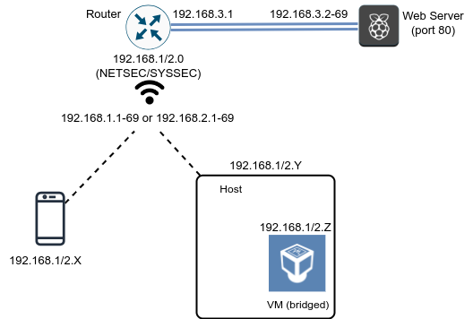

# Exercises: Network Layer Security

**The big picture:**\
Today we will perform Man-in-the-Middle (MitM) attacks. They come in two flavors: (i) A passive attack that listens and tries to gain information, and (ii) an active attack that tries to manipulate the traffic to gain further access and/or *wreak some havoc*!

## Preliminaries

You should begin by installing required dependencies. Make sure you have the Wireshark setup as described last week working natively or with a VM in bridged mode.

### Installing mitmproxy

<details>

<summary>Ubuntu 24.04 Virtual Machine</summary>

```
sudo apt install mitmproxy
```

</details>

<details>

<summary>WSL</summary>

At the time of writing, mitmproxy or ARP spoofing do not play well with the WSL virtualized network interface. Install native versions of [mitmproxy](https://downloads.mitmproxy.org/10.2.2/mitmproxy-10.2.2-windows-x86_64-installer.exe) and an [ARP spoofer](https://github.com/alandau/arpspoof).

</details>

<details>

<summary>Mac</summary>

```
brew install mitmproxy
```

</details>

### Network Layout - understanding the setup
**The big picture:**\
We are updating our setup: now the client and the server are not on the same local network! This has a few consequences, as you'll see - but we can still *wreak havoc* and have some fun!

**The details:**\
Our network will be slightly more complicated than the previous one. Instead of having all nodes connected to the same local network, we will keep `NETSEC` and `SYSSEC` as wireless networks, and segment the wired network to `192.168.3.0/24`. Now the Access Point (AP) serves as the _router_ between the wireless and wired networks. We will abstract the Web server running on a Raspberry Pi in the wired network on an addreess in range `192.168.3.2-69` as some Internet-facing server. A basic layout of the network is pictured below.



You may choose between two setups: 
1. The mobile setup - useful for analysing Android and iOS apps.
2. The personal computer setup - for analysing applications running on your computer, or if you have trouble with the mobile setup.

Choose a *victim* (mobile or PC) and a *Man-in-the-Middle (MitM)* machine (Native PC or a VM).
On the *victim*, connect to one of the wireless networks (you know the password) and test that you can connect to one of the WEB servers at `http://192.168.3.X/` using a Web browser. The traffic between your browser and the server is now being routed by the Access Point.

**Observation**: If accessing `192.168.3.X` fails, try to disable your mobile Internet access. Your phone might be trying to use that as the router.

Start the *MitM* machine and make sure that you can `ping 192.168.3.X` and access the HTTP address above in the *MitM* machine to verify that everything works. (If you're using the VM, this will verify that the interface is functional in bridged mode).

## Exercise 1: Manual proxy setup
**The big picture:**\
We'll start with a simplified setup. 
It's VERY powerful for performing a security analysis of a certain service/app/website/software - which is what you'll do in the final project. 
Note that this setup is not realistic for an attack on an unknowing victim in the local network because it requires a proxy configuration, but it captures an attacker in a privileged network position.

**The details:**\
Open the wifi settings of both the *victim* device and the *MitM* device.
For the victim, choose "manual proxy" and enter the IP-address of the *MitM* machine, and set the proxy port on the *victim* to 8080 (which is the port that the `mitmproxy` application runs on).

Now you should be able to open wireshark in the *MitM* machine and capture all the out-bound HTTP traffic of the *victim*.
However, the *victim* should not have a working internet connection anymore...


## Exercise 2: Restoring access and mounting the attack

**The big picture:**\
Now we'll finish the setup and you'll get to see what a real Man-in-the-Middle attack looks like! It can either be a passive MitM attack (reading all the traffic between the victim and the server) or the active version (manipulating the traffic between the victim and the server to break security). 
First we need to change two settings on the *MitM* machine, and then we run *mitmproxy* to mount the attack!
(Note: The phone's internet access will only be established once you have changed the settings **AND** are running mitmproxy on the *MitM* machine).

**The details:**\
We will run `mitmproxy` in the *mitm machine* to be able to perform some processing of the captured traffic.

**Note:**\
Understanding and performing MitM attacks will be VERY useful for the final project!

Run `mitmproxy` in _proxy_ mode:

```
$ mitmproxy --showhost 
```

If everything is working correctly, the *victim* should be able to access the Web server `http://192.168.3.X/`. While the *victim* is doing this, you should start seeing captured flows in the `mitmproxy` window on the *MitM* machine..
In the `mitmproxy` interface, you can select a flow by using the arrows and pressing ENTER, while pressing the letter `q` goes back to the overview screen.

1. Try accessing `http://192.168.3.X/` on the *victim*. Later you will use the *MitM* machine to change what the *victim* sees!

2. Perform a login with `admin`/`admin` on the *victim* and locate the credentials on the *MitM* machine.

## Exercise 3: Manipulate traffic
**The bic picture:**\
If you reached this point, GREAT! You've got the basics down. In the exercise above you could watch the traffic freely, but now we have a specific goal! *There's a very secret message that we need to see!*

**The details:**\
Let's use the scripting capability of `mitmproxy` to mount an *active* attack.
Our simple website has a login capability, for which the credentials are `admin`/`admin`.

Now access the website through your mobile device with the right credentials and login. You should now be able to access the `View Secrets` and `Upload Secrets` functionalities.

The `View Secrets` functionality will just show you some secret text, which should be visible in `mitmproxy` as well.
We will use the acripting capabilities of `mitmproxy` to change what the *victim* receives and sees.
Use the provided file `mitm.py` as a starting point and restart `mitmproxy` with the command below:

```
$ mitmproxy --showhost -s mitm.py
```

The `Upload Secrets` functionality is more interesting and allows the user to encrypt a message under a public key returned by the server.
Your final task is to _replace_ that public key with a key pair for which you know the private key (to be able to decrypt).
The code for the server portion is provided for reference in the repository inside the folder `simple-website`.

In order to achieve your goal, generate an RSA key pair in PEM format and plug the values marked as TODO in the file `simple-website/mitm_pk.py`. Now restart `mitmproxy` with the command below:

```
$ mitmproxy --showhost -s mitm_pk.py
```

Now the user will use a different public key, so you recover the secret message from the RSA encryption provided by the client.
The `client.py` file in the repository or [this link](https://pycryptodome.readthedocs.io/en/latest/src/examples.html#encrypt-data-with-rsa)  may be useful.

## BONUS Exercise: ARP Spoofing against router
**The big picture:**\
The goal is to mount a passive Man-in-the-Middle attack to be able to read *all* the traffic between a victim and a server (or any two devices, A and B), that are communicating over a non-local network. This time, we want a more realistic setup.

First of all, revert the proxy configuration you performed in the previous exercise.
Select one of the addresses in the range `192.168.3.2-69` (which will be called `X` from now on).
Try to impersonate the Web server by running the ARP spoofing attack inside the VM:

```
sudo arpspoof -i <interface> -t <victim> 192.168.3.X
```

Contrary to the last session, you can still access the Web server `http://192.168.3.X/` in the *victim*. This is possible because ARP spoofing is ineffective here, since ARP does not resolve in the network `192.168.3.0` to which packets are _routed_. This will also have the side-effect that traffic directed towards `192.168.3.X` will be passed to the VM through the link layer and fix an [issue with VirtualBox](https://security.stackexchange.com/questions/197453/mitm-using-arp-spoofing-with-kali-linux-running-on-virtualbox-with-bridged-wifi).
However, we can still impersonate the router.

Choose randomly one address in the IP range `192.168.1.1-69` or `192.168.2.1-69` (depending if you are connected to `SYSSEC` or `NETSEC`) and manually configure this address as the gateway in your mobile device. You can use the same IP address you received before from DHCP for the *victim*. Now run the ARP spoofing attack below:

```
sudo arpspoof -i <interface> -t <victim> <router>
```

You will notice that connectivity between the mobile device and the Web server might stop, since traffic will be redirected to the VM and not be routed further.

If you are running native Windows, you should instead run:

```
arpspoof.exe <router> <victim>
```

In the case of Windows, `arpspoof.exe` takes care of the routing, so you can skip to the part of running `mitmproxy`.

## BONUS Exercise: mitmproxy in transparent mode

Let's change the configuration for traffic to be forwarded again to the Web server.
The following configurations need to be performed in the VM to enable IP forwarding such that the VM can forward IPv4 traffic while avoiding ICMP redirects:

<details>

<summary>Linux / VM</summary>

```
$ sudo sysctl -w net.ipv4.ip_forward=1
$ sudo sysctl -w net.ipv4.conf.all.send_redirects=0

```

</details>

<details>

<summary>Mac</summary>

```
sudo sysctl -w net.inet.ip.forwarding=1
sudo sysctl -w net.inet.ip.redirect=0

```

</details>

After these configurations are put in place, the mobile device will be able to connect again to the Web server. Start Wireshark in the VM to check that the traffic is still intercepted there. You can use the Login option to enter credentials and observe that they are captured by Wireshark, proving that the traffic is redirected to the VM.

**Note:**\
There are some hints and troubleshooting information [in this page](hints.md). Make sure to check it if you have problems or if you are running a native enrivonment without support for virtualization (such as an ARM-based Mac).

Start Wireshark in the VM to check that the traffic is still intercepted there. You can use the Login option to enter credentials and observe that they are captured by Wireshark, proving that the traffic is proxied through the VM/laptop.
Wireshark will capture traffic and demonstrate the power of a passive eavesdropping attacker. Let's mount a more powerful attack.
First, configure the `iptables` firewall to send all HTTP traffic captured at port 80 in the VM to port 8080 under control of `mitmproxy`:

```
$ sudo iptables -A FORWARD --in-interface <interface> -j ACCEPT
$ sudo iptables -t nat -A PREROUTING -i <interface> -p tcp --dport 80 -j REDIRECT --to-port 8080
```

Now run `mitmproxy` in _transparent_ mode:

```
$ mitmproxy --mode transparent --showhost
```
The traffic from the *victim* should again be visible in the `mitmproxy` interface.
